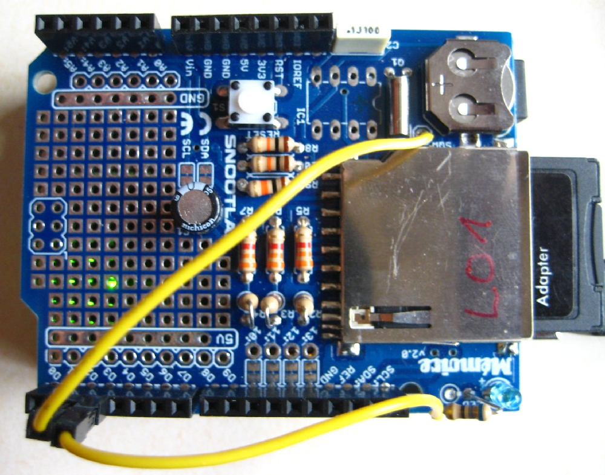

# SDI-logger
Arduino-based data logger for logging SDI-sensor data to SD-card with RTC-time stamp.

** Features
- requires low-cost datahardware (starting from 15 € [2019], excluding power supply, SD-card and casing)
- data loggin to SD-card
- use of low-drift clock (D3231)
- optional sleep mode to save power
- optional support of message LED for indiging multiple loggers

cating logger status
- optional assignment of unique logger-ID for mana
** Usage
- install hardware required (see "Hardware required" and "Wiring")
- install libraries (see "Software required")
- verify/set clock using separate script (e.g. set_clock.ino)
- verify/set logger-id using separate script (e.g. set_id.ino)
- adjust settings (see section "Settings" below)

** Hardware required
- tested with Arduino Uno, rev. 3
- D3231 real time clock, SD-card slot (or both combined in Shield, e.g. https:snootlab.com/lang-en/shields-snootlab/1233-memoire-20-ds3231-fr.html)
for wiring details, see below

** Software required:
Please install additional libraries via "Tools" -> "Manage Libraries" or download and extract libraries to c:\Program Files (x86)\Arduino\libraries\
 SDI: The library is available at: https://github.com/EnviroDIY/Arduino-SDI-12
 RTC: DS3231 https:github.com/NorthernWidget/DS3231; delete any existing library
 sleep mode: https:github.com/rocketscream/Low-Power V1.8

** Wiring
RTC (no wiring required when using Shield, except for SWQ (between battery and SD-card slot))
 SD-card-pin ->  Arduino-pin
 Vin -> 5 V
 GND -> GND
 SCL -> Analog 5
 SDA -> Analog 4
 SQW -> pin (default: 2)  (optional, required only when using sleep mode)

 SD card (no wiring required when using Shield):
 SD-card-pin ->  Arduino-pin
 MOSI -> pin D11
 MISO -> pin D12
 CLK (or SLK) -> pin D13
 CS -> pin (default: D10 )
 

SDI-12:
 You should not have more than one SDI-12 device attached for this example.
 SDI-device ->  Arduino-pin 
 GND -> GND
 +Vbat -> 5 V (if the external device needs more than 5 V, connect it to external battery instead of the Arduino-pin)
 SDI-12 Data -> pin (default: D7) 
 e.g. Truebner SMC: data: green; ground: white; V+: brown
      delta_T PR2: data: black; ground: blue; V+: white (needs external 12 V)
 

message LED (optional):
  Connect LED with appropriate resistor to pin 3 (default) and ground.
  The LED  can issue the following codes:
  off: sleep mode
  slow (1 s) blinking: wating for sensor reading
  2 short flashes every 2 secs: no SD-card found
  3 short flashes every 2 secs: SD-card write error
  4 short flashes every 2 secs: no data from sensor
  

An Arduino Uno equipped with a Snootlab Shield. Pin D2 has been connected to wire soldered to SQW on the board. The blue LED in the lower right (actually a power LED) has been re-configured to serve as the message LED: The left side of the adjacent resistor was soldered off the Shield and instead connected to the wire leading to D3. Both wire still use the connector plugs, but could likewise also be soldered directly to the contact line on the shield.